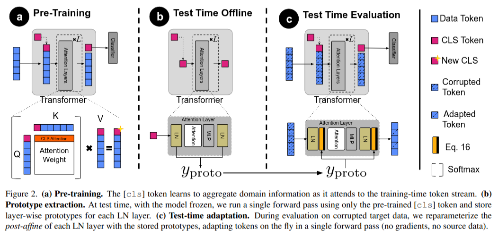

# Revisiting Layer Normalization for Point Cloud Test Time Adaptation

This code is mainly based on MATE code base: https://github.com/jmiemirza/MATE

## Abstract
We analyze Layer Normalization (LN) from a domain (batch) perspective and explain why BatchNorm-style test-time fixes often fail on Transformer backbones. As feature dimension and batch size grow, the per-feature batch marginals after LN's pre-affine step concentrate at mean approximates 0, and variance approximates 1, making cross-batch re-standardization unnecessary and often harmful. This yields a simple rule: keep the pre-affine LN intact and adjust only the post-affine mean and gain. We instantiate this with **LN-TTA**, a backpropagation-free and source-free, test-time adaptation that performs a single forward pass and uniformly reparameterizes each LN layer. On three corrupted 3D point-cloud suites (ScanObjectNN-C, ModelNet40-C, ShapeNet-C), LN-TTA improves over Source-Only by $+12.35$, $+15.58$, and $+3.03$ points, surpasses backpropagation baselines (e.g., TENT), and sustains up to $93$ samples per second, on average $39\times$ faster and $5\times$ more memory-efficient than the next-best backprop-free method. The implementation will be publicly available.

## Data and pre trained preparation
For data preparation please refer to the [MATE github](https://github.com/jmiemirza/MATE). After preparing the datasets, set the address in the config files both for datasets and the 

Please download the pre-trained weight from [MATE github](https://github.com/jmiemirza/MATE) (Just source only weights) and place them in the checkpoints directory

## Environment
Instal the environment using these commonds:
conda create -n tta_purge python=3.10
conda activate tta_purge
conda install pytorch==2.4.1 torchvision==0.19.1 torchaudio==2.4.1 pytorch-cuda=12.1 -c pytorch -c nvidia

pip install -r requirements.txt

pip install -U 'git+https://github.com/facebookresearch/iopath'
pip install "git+https://github.com/facebookresearch/pytorch3d.git"

## Reproducing the results
please Set the GPU id inside the commands_lntta.sh and run it to reproduce all results.
